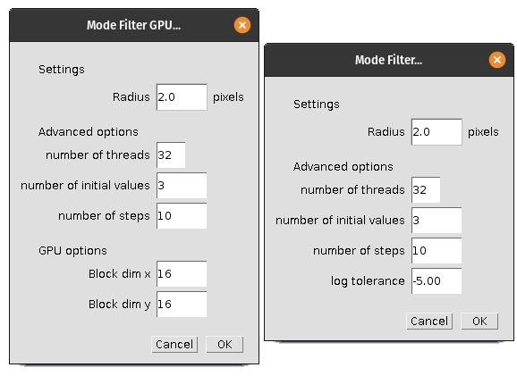
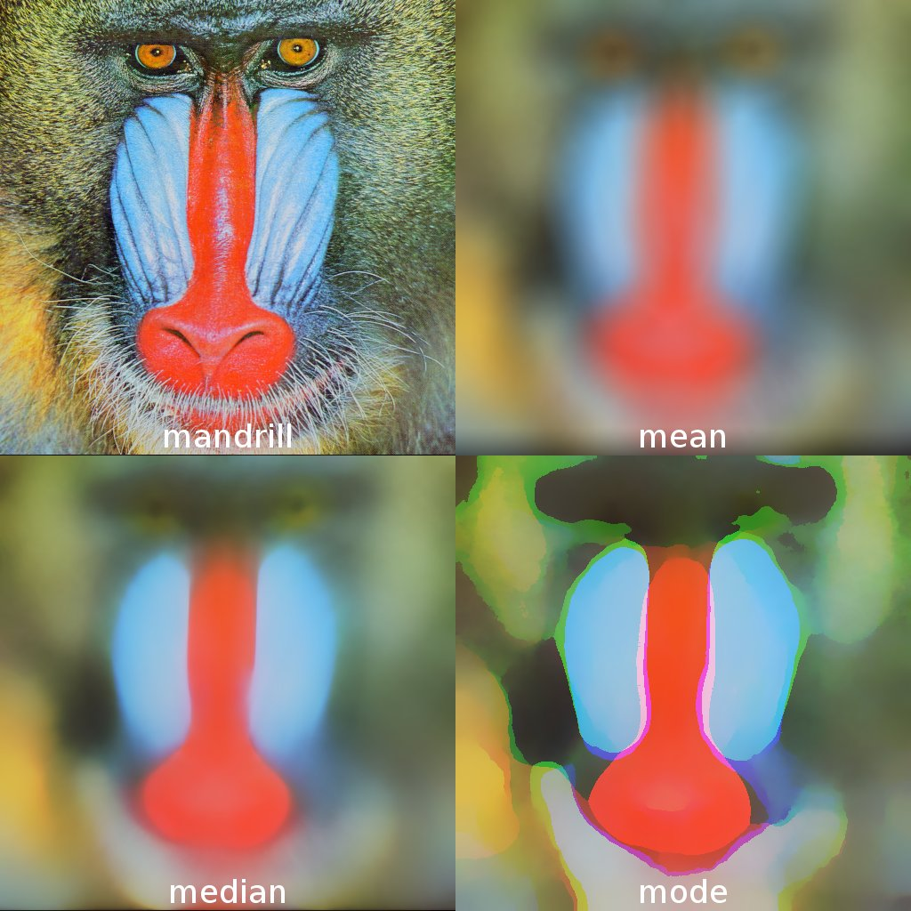

# Mode Filter and Empirical Null Filter

* MIT License - all source code
* Copyright (c) 2020-2024 Sherman Lo

The mode filter is an edge-preserving smoothing filter by taking the local mode
of the empirical density. This may have applications in image processing such as
image segmentation. The filter is available:

* As an *ImageJ* plugin which uses either the CPU or an *Nvidia* GPU. By
  extension, developers may use the Java API or the provided CLI.
* As a Python package using an *Nvidia* GPU only.

The *CUDA* binding to *Java* and *Python* was done using *JCuda* and *CuPy*
respectively. The use of a GPU speeds up the filtering by a huge margin.

Where appropriate, please cite the thesis

* Lo, S.E. (2020). *Characterisation of Computed Tomography Noise in Projection
  Space with Applications to Additive Manufacturing*. PhD thesis, University of
  Warwick, Department of Statistics.


The mode filter was applied to the
[Mandrill test image](http://sipi.usc.edu/database/database.php?volume=misc).
Top left to top right, bottom left to bottom right: mandrill test image with
the mode filter with a radius of 2, 4, 8, 16, 32, 64, 128 applied.

## How to Compile (Linux recommended)

Clone this repository and follow the instructions below in order:

* If you require the use of a GPU (mandatory for the Python implementation),
  follow the instructions for compiling the *CUDA* code.
* Afterwards, there are instructions for:
  * Compiling the *Java* code into a `.jar` file. This can be used as an
    *ImageJ* plugin or using the provided CLI
  * Building the Python package and installing it

## Instructions For Compiling *CUDA* Code (for GPU)

Compiling *CUDA* code for the use of an *Nvidia* GPU requires *GCC* and the
*Nvidia CUDA Development Kit*, a version appropriate for your GPU, which should
include an *nvcc* compiler.

Older versions of the *Nvidia CUDA Development Kit* can be found in the
[archive](https://developer.nvidia.com/cuda-toolkit-archive).

Identify the architecture of your GPU by looking it up in the manual for
the [NVIDIA CUDA Compiler Driver NVCC Section 5.2](https://docs.nvidia.com/cuda/cuda-compiler-driver-nvcc/)
or other sources such as
[this](https://arnon.dk/matching-sm-architectures-arch-and-gencode-for-various-nvidia-cards/).
For example:

* An *Nvidia Tesla K80* has a Kepler architecture with code `sm_37`.
* An *Nvidia Tesla V100* has a Volta architecture with code `sm_70`.
* An *Nvidia GeForce GTX 1660* has a Turing architecture with code `sm_75`.
* An *Nvidia A100* has an Ampere architecture with code `sm_80`.

Edit the file `Makefile`, replacing `-arch=sm_NN` with the code which
corresponds to the architecture of your GPU. This occurs when defining
`NVCCFLAGS`. For example with a A100 card, the `Makefile` should be edited so
that the definition of `NVCCLFAGS` should look like

```shell
NVCCFLAGS	:= -arch=sm_80 --ptxas-options=-v --use_fast_math
```

Compile the code into a `.ptx` file by calling

```shell
make
```

The compiled `.ptx` file should be located in both `cuda/` and
`python/modefilter/`.

## Instructions For Compiling Java Code (for both CPU and GPU)

Requires *Java Runtime Environment*, *Java Development Kit* and *Maven*.

At `pom.xml`, run

```shell
mvn package
```

to compile the *Java* code. The compiled `.jar` file should be located in
`target/Empirical_Null_Filter-*.*.*.jar` and can be used as an *ImageJ* plugin.
Copies of required libraries are stored in `target/libs/` and would need to be
installed in *ImageJ* as well.

### Instructions For Installing And Using The ImageJ Plugin (*Fiji* recommended)

The required `.jar` files can be obtained by either compiling (CPU and GPU) or
downloading from the
[releases](https://github.com/shermanlo77/modefilter/releases) (CPU only) and
extracting from `target.zip`.

Installation of `Empirical_Null_Filter-*.*.*.jar` can be done by copying the
file into *Fiji*'s `plugins/` directory or, in *Fiji*, using the *Plugins* menu
followed by *Install...* (or Ctrl + Shift + M).

The required `.jar` libraries are to be copied into *Fiji*'s `jars/` directory.
They are:

* `commons-math3-3.6.1.jar` (may already be provided)
* `jcuda-10.1.0.jar` (for GPU usage)
* `jcuda-natives-10.1.0-linux-x86_64.jar` (or similar for GPU usage)

### ImageJ Options



* Number of (CPU) threads
  * Number of CPU threads to use when doing mean, median and quantile filtering.
    Currently, they are only implemented on the CPU. These are used as inputs
    for mode filtering. Thus there will be some CPU computation even in the
    GPU version of the mode filter. It will default to use all detectable
    threads.
* Number of initial values
  * Number of initial values for the Newton-Raphson method. Increase this for
    more accurate filtering at a price of more computational time. Compared to
    other options, this has a big effect on the resulting image. The default
    value is 3 but should be in the order of 50-100 if this filter is to be
    applied to (non-Gaussian) images.
* Number of steps
  * Number of iterations in the Newton-Raphson method. Increase this for more
    accurate filtering at a price of more computational time.
* Log tolerance (CPU version only)
  * The tolerance allowed for the Newton-Raphson method to accept the solution.
    Decrease this for more accurate filtering at a price of more computational
    time.
* Block dim x and y (GPU version only)
  * Sets the dimensions of the block of threads on the GPU. This affects the
    performance of the filter. Good suggestions are 16 and 32. Solutions are
    shared between neighbours within blocks.

### Using the CLI

The mode filter can be used via the terminal. Go to `target/` and run the
`.jar` file. To use a GUI for parameter selection

```shell
java -jar Empirical_Null_Filter-x.x.x.jar gui ['cpu' or 'gpu'] \
    <loc of image to filter>
```

This will make a GUI appear to select your parameters. Once selected, click OK
to filter the image. A dialogue box will appear to save the resulting image in
`.png` format.

To run the mode filter without a GUI

```shell
java -jar Empirical_Null_Filter-x.x.x.jar run ['cpu' or 'gpu'] \
    <loc of image to filter> <loc to save resulting .png> [options]
```

where the options are

* `-r` radius of the kernel
* `-n` number of CPU threads
* `-i` number of initial points for Newton-Raphson
* `-s` number of steps for Newton-Raphson
* `-t` stopping condition tolerance for Newton-Raphson (recommend negative
  number), only for CPU
* `-x` x block dimension, only for GPU
* `-y` y block dimension, only for GPU

## Instructions For Building and Installing the Python Package

Requires `setuptools`. Verify the compiled `.ptx` file is located in
`python/modefilter/`.

At `pyproject.toml`, run

```shell
python -m build
```

which will build the package. To install it, run

```shell
pip install dist/modefilter*.whl
```

### Troubleshooting *CuPy*

You may require a version of *CuPy* which uses a specific version of *CUDA*. In
that case, you may edit the file `pyproject.toml` with the version of *CuPy*
you want. For example, if you require *CuPy* with *CUDA* 11, edit the
`dependencies` to contain

```toml
dependencies = [
    "numpy",
    "scipy",
    "cupy-cuda11x",
]
```

Please refer to the
[CuPy installation documentation](https://docs.cupy.dev/en/stable/install.html).

## Apptainer

[Apptainer](https://apptainer.org/) definition files are provided as a way to
compile *CUDA* and *Java* code in a container as well as use it. There is also
a definition file which builds a wheel for *Python*.

### Apptainer For Java (CPU)

To build the container

```shell
apptainer build modefilter-cpu.sif modefilter-cpu.def
```

To apply the mode filter on an image using the container via the terminal

```shell
apptainer run modefilter-cpu.sif run cpu \
    <loc of image to filter> <loc to save resulting .png> [options]
```

where the options are the same in the previous section.

The compiled `.jar` files can be extracted using

```shell
apptainer exec \
    modefilter-cpu.sif cp -r /usr/local/src/modefilter/target <destination>
```

### Apptainer For Java (GPU)

Identify the architecture of your GPU (as discussed previously here).
For example:

* An *Nvidia Tesla V100* has a Volta architecture with code `sm_70`.
* An *Nvidia GeForce GTX 1660* has a Turing architecture with code `sm_75`.
* An *Nvidia A100* has an Ampere architecture with code `sm_80`.

Edit `modefilter-gpu.def` so that `nvcc_arch` has the correct architecture code,
for example:

* For an *Nvidia GeForce GTX 1660*
  * `nvcc_arch="-arch=sm_75"`

The container can be built

```shell
apptainer build modefilter-gpu.sif modefilter-gpu.def
```

To apply the mode filter on an image using the container via the terminal, use
the `--nv` flag

```shell
apptainer run --nv modefilter-gpu.sif run ['cpu' or 'gpu'] \
    <loc of image to filter> <loc to save resulting .png> [options]
```

### Apptainer For Python (GPU)

Similarly to the Apptainer for *Java*, edit `modefilter-python.def` so that
`nvcc_arch` has the correct architecture code.

The container can be built

```shell
apptainer build modefilter-python.sif modefilter-python.def
```

The compiled `.whl` file can be extracted using

```shell
apptainer exec \
    modefilter-python.sif bash -c \
    "cp /usr/local/src/modefilter/dist/modefilter-*.whl <destination>"
```

Running the container will run *Python* with the `modefilter` package available.

```shell
apptainer run --nv modefilter-python.sif run
```

### Further Troubleshooting

Depending on your GPU architecture, you may require an older version of the
*Nvidia CUDA Toolkit*. For example, a *Nvidia Tesla K80* is supported by the
*Nvidia CUDA Toolkit* version 10.1. Refer to *Nvidia*'s *CUDA* toolkit
[archive](https://developer.nvidia.com/cuda-toolkit-archive).

## About the Mode Filter

The mode filter is an image filter much like the mean filter and median filter.
They process each pixel in an image. For a given pixel, the value of the pixel
is replaced by the mean or median over all pixels within a distance *r* away.
The mean and median filter can be used in *ImageJ*, it results in a smoothing of
the image.


Top left:
[Mandrill test image](http://sipi.usc.edu/database/database.php?volume=misc).
Top right: Mean filter with radius 32. Bottom left: Median filter with
radius 32. Bottom right: Mode filter with radius 32.

The mode filter is a by-product of the empirical null filter. Instead of taking
the mean or median, the mode is taken, more specifically, the argmax of the
empirical density. The optimisation problem was solved using the Newton-Raphson
method. Various random initial values were tried to home in on the global
maximum. Because the filtered image is expected to be smooth, the different
initial values were influenced by neighbouring pixels to aid in the optimisation
problem.

The resulting mode-filtered image gives a smoothed image which has an impasto
effect and preserved edges. This may have applications in noise removal or image
segmentation.

The mode filter was implemented on the CPU by modifying existing *Java* code
from *ImageJ*. Each thread filters a row of the image in parallel from left to
right. The solution to one pixel is passed to the pixel to the right. The filter
was also implemented on the GPU by writing *CUDA* code which can be compiled and
read by the *JCuda* package. The image is split into blocks. Within a block,
each thread filters a pixel and shares its answer with neighbouring pixels
within that block.

One difficulty is that with the introduction of *CUDA* code, the ability to
"compile once, run anywhere" is difficult to keep hold of. A design choice was
that the user is to compile the *CUDA* code into a `.ptx` file. This is then
followed by compiling the *Java* code with the `.ptx` file into a `.jar` file
which can be installed as a Plugin in *ImageJ* or *Fiji*. The compiled `.jar`
file can be used by *MATLAB* as well.

## Further Reading and References

* Lo, S.E. (2020). *Characterisation of Computed Tomography Noise in Projection
  Space with Applications to Additive Manufacturing*. PhD thesis, University of
  Warwick, Department of Statistics.
* Efron, B. (2004). Large-scale simultaneous hypothesis testing: The choice of a
  null hypothesis. *Journal of the American Statistical Association*,
  99(465):96.
* Griffin, L. D. (2000). Mean, median and mode filtering of images. *Proceedings
  of the Royal Society of London A: Mathematical, Physical and Engineering
  Sciences*, 456(2004):2995–3004.
* Charles, D. and Davies, E. R. (2003). Properties of the mode filter when
  applied to colour images. *International Conference on Visual Information
  Engineering VIE 2003*, pp. 101-104.
