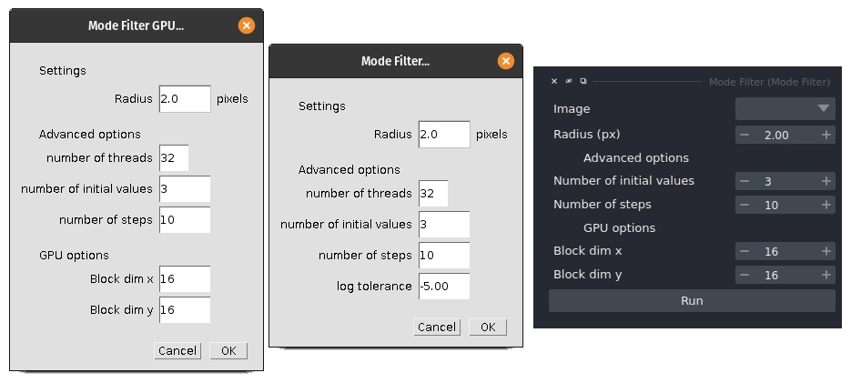
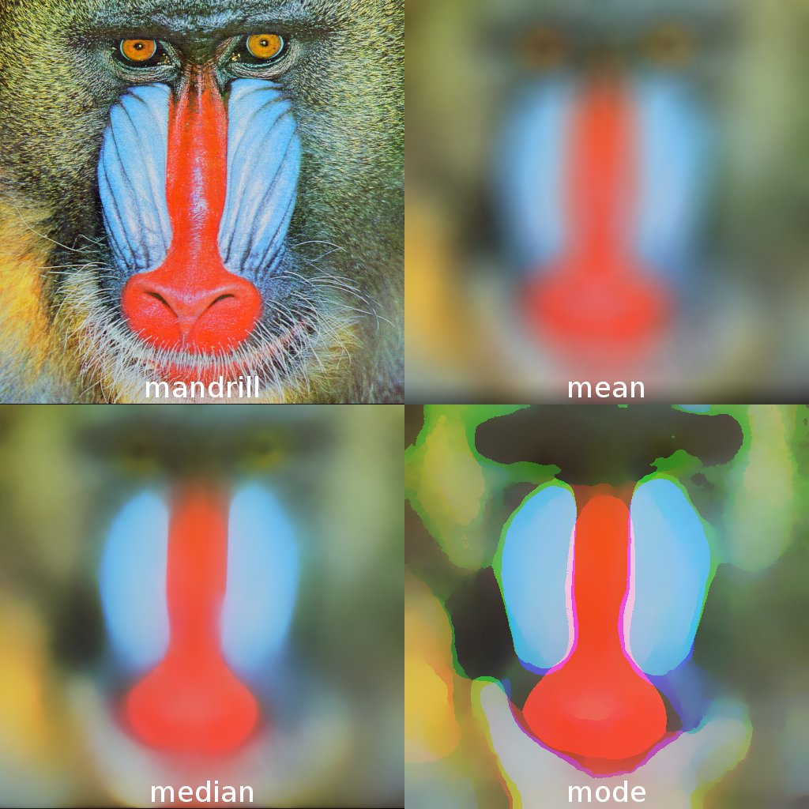

# Mode Filter and Empirical Null Filter

* MIT License - all source code
* Copyright (c) 2020-2025 Sherman Lo

The mode filter is an edge-preserving smoothing filter that takes the local mode
of the empirical density. This may have applications in image processing such as
image segmentation. The filter is available:

* As an *ImageJ/Fiji* plugin which uses either the CPU or an *Nvidia* GPU. By
  extension, developers may use the Java API or the provided CLI
* As a *Napari* plugin which uses an *Nvidia* GPU only. By extension, developers
  may integrate it within their Python code

The *CUDA* bindings to *Java* and *Python* were implemented using *JCuda* and *CuPy*
respectively. The use of a GPU speeds up the filtering by a huge margin.

Where appropriate, please cite the thesis

* Lo, S.E. (2020). *Characterisation of Computed Tomography Noise in Projection
  Space with Applications to Additive Manufacturing*. PhD thesis, University of
  Warwick, Department of Statistics.


The mode filter was applied to the
[Mandrill test image](http://sipi.usc.edu/database/database.php?volume=misc).
Top left to top right, bottom left to bottom right: mandrill test image with
the mode filter with a radius of 2, 4, 8, 16, 32, 64, 128 applied.

## Compiling and Installing Instructions

The instructions for compiling and installing the following are provided:

* *ImageJ/Fiji* plugin using the CPU only
* *ImageJ/Fiji* plugin using either the CPU or an Nvidia GPU
* *Napari* plugin using an Nvidia GPU only

If you wish to use an Nvidia GPU, you will need to identify the architecture of
your GPU by looking it up in the
[CUDA GPU compilation documentation](https://docs.nvidia.com/cuda/cuda-compiler-driver-nvcc/#gpu-feature-list)
or other sources such as
[this](https://arnon.dk/matching-sm-architectures-arch-and-gencode-for-various-nvidia-cards/).
For example:

* An *Nvidia V100* has a Volta architecture with code `sm_70`.
* An *Nvidia GeForce GTX 1660* has a Turing architecture with code `sm_75`.
* An *Nvidia A100* has an Ampere architecture with code `sm_80`.
* An *Nvidia H100* has an Ampere architecture with code `sm_90`.

You will also require the [*Nvidia CUDA Development
Kit*](https://developer.nvidia.com/cuda/toolkit), a version appropriate for your
GPU, which should include an *nvcc* compiler. Older versions of the *Nvidia CUDA
Development Kit* can be found in the
[archive](https://developer.nvidia.com/cuda-toolkit-archive).

### ImageJ (CPU only)

* Download `target.zip` from the
  [releases](https://github.com/shermanlo77/modefilter/releases) and extract it.
* Copy `target/Empirical_Null_Filter-*.*.*.jar` into
  `<location of ImageJ>/plugins/`
* Copy the directory (or the contents) `target/libs` to
  `<location of ImageJ>/jars`

where `<location of ImageJ>` is the location of your *ImageJ* or *Fiji* software

### ImageJ (CPU and GPU)

Compile the *CUDA* code  into a `.ptx` file by calling `make` and providing your
GPU architecture. For example, for an *Nvidia A100* with code `sm_80`

```shell
make NVCC_ARCH=sm_80
```

Clone this repository and compile the package with
[*Maven*](https://maven.apache.org/)

```shell
mvn package
```

The compiled files are in the direction `target/`. Copy the following:

* Copy `target/Empirical_Null_Filter-*.*.*.jar` into
  `<location of ImageJ>/plugins/`
* Copy the directory (or the contents) `target/libs` to
  `<location of ImageJ>/jars`

where `<location of ImageJ>` is the location of your *ImageJ* or *Fiji* software

### Napari (GPU only)

Requires the latest version of `build`.

Compile the *CUDA* code  into a `.ptx` file by calling `make` and providing your
GPU architecture. For example, for an *Nvidia A100* with code `sm_80`

```shell
make NVCC_ARCH=sm_80
```

Clone this repository and, within a [virtual
environment](https://docs.python.org/3/library/venv.html), install the package
and *Napari* with *pip* or similarly

```bash
pip install -e .
pip install -e .[cuda12x]
pip install -e .[napari]
```

#### Troubleshooting *CuPy*

You may require a version of *CuPy* which uses a specific version of *CUDA*. In
that case, for example, you can use `pip install -e .[cuda11x]` to use CUDA 11
instead.

Please refer to `pyproject.toml` and the [CuPy installation
documentation](https://docs.cupy.dev/en/stable/install.html).

## How to Use

### With ImageJ or Napari

The mode filter should be available under `Plugins`



The following options, where available, are:

* Number of (CPU) threads
  * Number of CPU threads to use when doing mean, median and quantile filtering.
    These are used as inputs for mode filtering. Defaults to the number of
    detectable threads.
  * For the CPU only implementation of the mode filter, this also sets the
    number of CPU threads when doing mode filtering.
* Number of initial values
  * Number of initial values for the Newton-Raphson method. Increase this for
    more accurate filtering at a price of more computational time. Compared to
    other options, this has a big effect on the resulting image. The default
    value is 3 but should be in the order of 50-100 if this filter is to be
    applied to (non-Gaussian) images.
* Number of steps
  * Number of iterations in the Newton-Raphson method. Increase this for more
    accurate filtering at a price of more computational time.
* Log tolerance (CPU only)
  * The tolerance allowed for the Newton-Raphson method to accept the solution.
    Decrease this for more accurate filtering at a price of more computational
    time.
* Block dim x and y (GPU only)
  * Set the dimensions of the block of threads on the GPU. This affects the
    performance of the filter. Good suggestions are 16 and 32. It is recommended
    that the number of threads per block should be a multiple of 32.

### Using the CLI (Java only)

The mode filter can be used via the terminal by calling the
`Empirical_Null_Filter-x.x.x.jar` file. To use a GUI for parameter selection

```shell
java -jar Empirical_Null_Filter-x.x.x.jar gui ['cpu' or 'gpu'] \
    <loc of image to filter>
```

This will make a GUI appear to select your parameters. Once selected, click OK
to filter the image. A dialogue box will appear to save the resulting image in
`.png` format.

To run the mode filter without a GUI

```shell
java -jar Empirical_Null_Filter-x.x.x.jar run ['cpu' or 'gpu'] \
    <loc of image to filter> <loc to save resulting .png> [options]
```

where the options are

* `-r` radius of the kernel
* `-n` number of CPU threads
* `-i` number of initial points for Newton-Raphson
* `-s` number of steps for Newton-Raphson
* `-t` stopping condition tolerance for Newton-Raphson (recommend negative
  number), only for CPU
* `-x` x block dimension, only for GPU
* `-y` y block dimension, only for GPU

## Apptainer

[Apptainer](https://apptainer.org/) definition files are provided as a way to
compile *CUDA* and *Java* code and install the plugins in *ImageJ* or *Napari*
inside a container. These may be useful in further troubleshooting.

### Apptainer For ImageJ (CPU)

To build the container

```shell
apptainer build modefilter-ij-cpu.sif modefilter-ij-cpu.def
```

To run *ImageJ*

```shell
apptainer run modefilter-ij-cpu.sif
```

For release purposes, the compiled `target/` can be extracted using

```shell
apptainer exec \
    modefilter-ij-cpu.sif cp -r /usr/src/modefilter/target <destination>
```

### Apptainer For ImageJ (CPU and GPU)

Edit `modefilter-ij-gpu.def` so that `nvcc_arch` has the correct architecture
code.

To build the container

```shell
apptainer build modefilter-ij-gpu.sif modefilter-ij-gpu.def
```

To run *ImageJ*

```shell
apptainer run --nv modefilter-ij-gpu.sif
```

### Apptainer For Napari (GPU only)

Edit `modefilter-napari.def` so that `nvcc_arch` has the correct architecture
code and `cupy_version` with the required CuPy version.

Older versions of CuPy may need an older version of the bootstrapped Ubuntu. For
example with `cupy_version="cuda11x"`, you may need to edit to bootstrap to
`From: ubuntu:22.04`.

To build the container

```shell
apptainer build modefilter-napari.sif modefilter-napari.def
```

To run *Napari*

```shell
apptainer run --nv modefilter-napari.sif
```

## About the Mode Filter

The mode filter is an image filter much like the mean filter and the median
filter. They process each pixel in an image. For a given pixel, the value of the
pixel is replaced by the mean or median over all pixels within a distance *r*
away. The mean and median filters can be used in *ImageJ*, resulting in a
smoothing of the image.


Top left:
[Mandrill test image](http://sipi.usc.edu/database/database.php?volume=misc).
Top right: Mean filter with radius 32. Bottom left: Median filter with
radius 32. Bottom right: Mode filter with radius 32.

The mode filter is a by-product of the empirical null filter. Instead of taking
the mean or median, the mode is taken, more specifically, the argmax of the
empirical density. The optimisation problem was solved using the Newton-Raphson
method. Various random initial values were tried to home in on the global
maximum. Because the filtered image is expected to be smooth, the different
initial values were influenced by neighbouring pixels to aid in the optimisation
problem.

The resulting mode-filtered image gives a smoothed image which has an impasto
effect and preserved edges. This may have applications in noise removal or image
segmentation.

The mode filter was implemented on the CPU by modifying existing *Java* code
from *ImageJ*. Each thread filters a row of the image in parallel from left to
right. The solution to one pixel is passed to the pixel to the right. The filter
was also implemented on the GPU by writing *CUDA* code which can be compiled and
read by the *JCuda* package. The image is split into blocks. Within a block,
each thread filters a pixel and shares its answer with neighbouring pixels
within that block.

One difficulty is that with the introduction of *CUDA* code, the ability to
"compile once, run anywhere" is difficult to keep hold of. A design choice was
that the user is to compile the *CUDA* code into a `.ptx` file. This is then
followed by compiling the *Java* code with the `.ptx` file into a `.jar` file
which can be installed as a Plugin in *ImageJ* or *Fiji*. The compiled `.jar`
file can be used by *MATLAB* as well.

## Further Reading and References

* Lo, S.E. (2020). *Characterisation of Computed Tomography Noise in Projection
  Space with Applications to Additive Manufacturing*. PhD thesis, University of
  Warwick, Department of Statistics.
* Efron, B. (2004). Large-scale simultaneous hypothesis testing: The choice of a
  null hypothesis. *Journal of the American Statistical Association*,
  99(465):96.
* Griffin, L. D. (2000). Mean, median and mode filtering of images. *Proceedings
  of the Royal Society of London A: Mathematical, Physical and Engineering
  Sciences*, 456(2004):2995–3004.
* Charles, D. and Davies, E. R. (2003). Properties of the mode filter when
  applied to colour images. *International Conference on Visual Information
  Engineering VIE 2003*, pp. 101-104.
